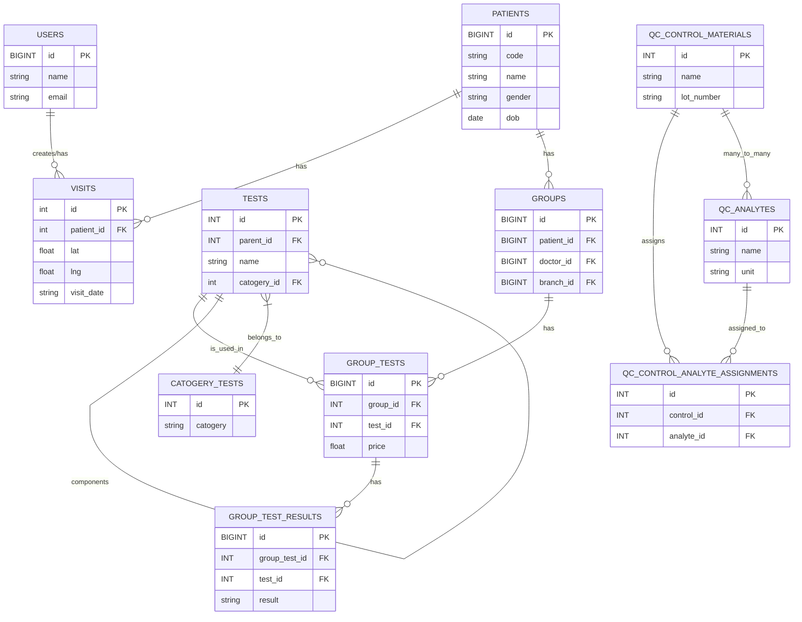

# Database ER Diagram

```mermaid
erDiagram
  USERS {
    BIGINT id PK
    string name
    string email
  }
  PATIENTS {
    BIGINT id PK
    string code
    string name
    string gender
    date dob
  }
  VISITS {
    int id PK
    int patient_id FK
    float lat
    float lng
    string visit_date
  }
  TESTS {
    INT id PK
    INT parent_id FK
    string name
    int catogery_id FK
  }
  CATOGERY_TESTS {
    INT id PK
    string catogery
  }
  GROUPS {
    BIGINT id PK
    BIGINT patient_id FK
    BIGINT doctor_id FK
    BIGINT branch_id FK
  }
  GROUP_TESTS {
    BIGINT id PK
    INT group_id FK
    INT test_id FK
    float price
  }
  GROUP_TEST_RESULTS {
    BIGINT id PK
    INT group_test_id FK
    INT test_id FK
    string result
  }
  QC_ANALYTES {
    INT id PK
    string name
    string unit
  }
  QC_CONTROL_MATERIALS {
    INT id PK
    string name
    string lot_number
  }
  QC_CONTROL_ANALYTE_ASSIGNMENTS {
    INT id PK
    INT control_id FK
    INT analyte_id FK
  }

  USERS ||--o{ VISITS : "creates/has"
  PATIENTS ||--o{ VISITS : "has"
  PATIENTS ||--o{ GROUPS : "has"
  GROUPS ||--o{ GROUP_TESTS : "has"
  TESTS ||--o{ GROUP_TESTS : "is_used_in"
  GROUP_TESTS ||--o{ GROUP_TEST_RESULTS : "has"
  TESTS ||--o{ TESTS : "components"
  TESTS }|--|| CATOGERY_TESTS : "belongs_to"
  QC_CONTROL_MATERIALS ||--o{ QC_CONTROL_ANALYTE_ASSIGNMENTS : "assigns"
  QC_ANALYTES ||--o{ QC_CONTROL_ANALYTE_ASSIGNMENTS : "assigned_to"
  QC_CONTROL_MATERIALS ||--o{ QC_ANALYTES : "many_to_many"
```
