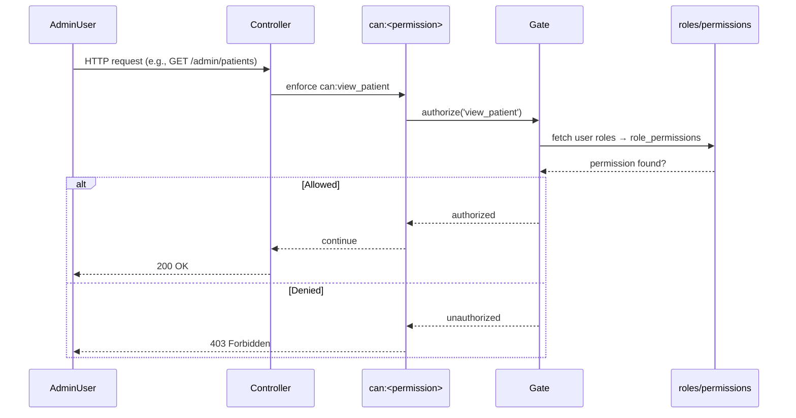
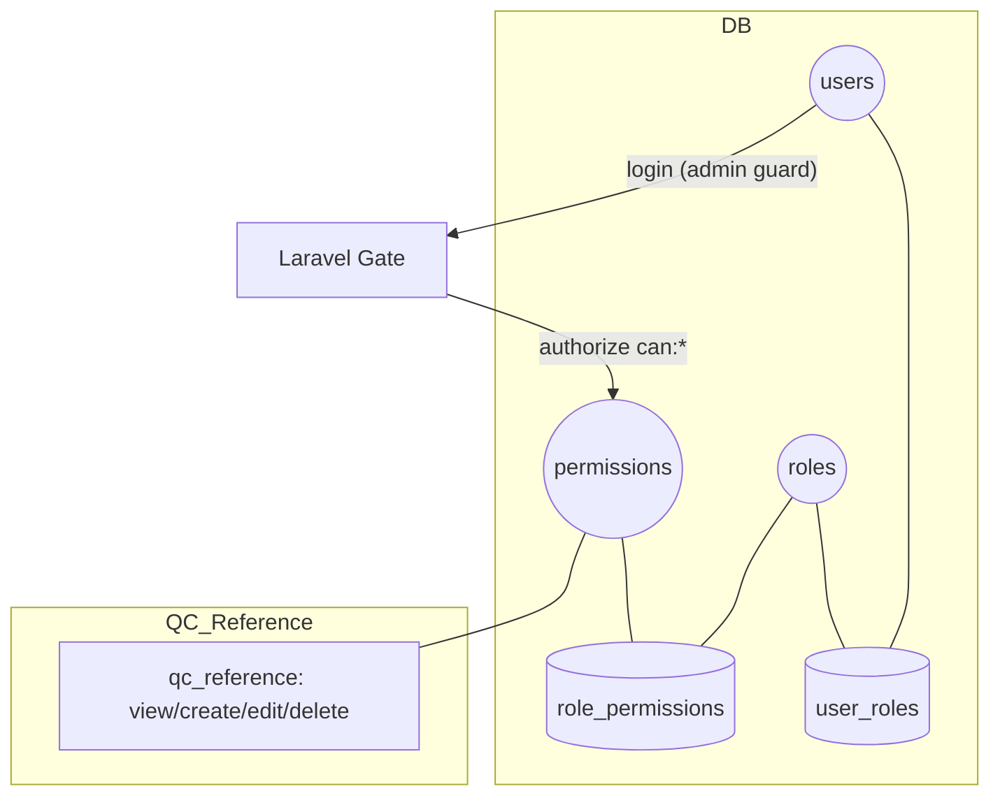

## QC RBAC Integration Plan

This document describes the current authorization architecture, proposes permission keys for the QC module under `/admin/qc`, and outlines how to enforce them across controllers, routes, and UI. No code changes are included here; this is a plan for implementation.

### Current Authorization Architecture 

- RBAC using Laravel Gates.
- Gates are dynamically registered from `permissions.key` in the database.
- Admin guard is used; user with ID 1 is super admin and bypasses authorization.
- Controllers enforce permissions via `can:<permission>` middleware on actions.

Example (patients controller middleware):

```php
$this->middleware('can:view_patient',     ['only' => ['index', 'show', 'ajax']]);
$this->middleware('can:create_patient',   ['only' => ['create', 'store']]);
$this->middleware('can:edit_patient',     ['only' => ['edit', 'update']]);
$this->middleware('can:delete_patient',   ['only' => ['destroy']]);
```

Gates defined from DB permissions (conceptual):

```php
foreach (Permission::all() as $permission) {
    Gate::define($permission->key, function () use ($permission) {
        if (auth()->guard('admin')->check()) {
            if (auth()->guard('admin')->user()->id == 1) {
                return true;
            }
            $roleIds = UserRole::where('user_id', auth()->guard('admin')->id())->pluck('role_id');
            return RolePermission::whereIn('role_id', $roleIds)->where('permission_id', $permission->id)->exists();
        }
        return false;
    });
}
```

### Mermaid: Current RBAC Flow



### QC Area Today

- Routes exist under `/admin/qc` (analytes, materials, reference, entries) but are not protected with `can:*` middleware.
- Controllers: `QcAnalytesController`, `QcControlMaterialsController`, `QcReferenceValuesController`, `QcEntriesController`.

### Proposed QC Permission Keys (Reference Values Forms ONLY)

For this phase, we introduce permissions only for Reference Values Forms, following the system’s CRUD naming convention:

- Reference Values Forms:
  - `view_qc_reference`
  - `create_qc_reference`
  - `edit_qc_reference`
  - `delete_qc_reference` (future use if explicit delete endpoint is added)

Notes:
- No new permissions for Analytes, Control Materials, or Entries at this time.
- These keys will be inserted into `permissions` and mapped via `role_permissions` to roles.

### Role Assignment Guidelines (Reference Values Forms)

- QC Manager: `view_qc_reference`, `create_qc_reference`, `edit_qc_reference` (optional `delete_qc_reference` if needed).
- Lab Tech: `view_qc_reference`, `create_qc_reference`, `edit_qc_reference` (no delete).
- Viewer/Auditor: `view_qc_reference` only.

### Enforcement Plan (Controllers)

Scope enforcement to Reference Values Forms:

- QcReferenceValuesController
  - `options`, `load` → `can:view_qc_reference`
  - `save` →
    - if creating new values → `can:create_qc_reference`
    - if updating existing values → `can:edit_qc_reference`
  - (future) delete endpoint → `can:delete_qc_reference`

Other QC controllers (Analytes, Materials, Entries) remain unchanged in this phase.

### Enforcement Plan (Routes/UI)

- Combined page: `/admin/qc/materials-combined?analyte_id=...`
  - The Reference Values Forms section must behave as follows based on permissions:
    - `view_qc_reference` only → show values read-only (inputs disabled), hide Save/Reset controls.
    - `create_qc_reference` (no existing values) → allow entering new values and Save; show Reset only if it doesn’t delete data.
    - `edit_qc_reference` (existing values) → allow editing and Save/Reset.
    - Optional future: actions that clear/delete should require `delete_qc_reference`.
- Backend must validate permissions regardless of UI state (defense in depth).

### Mermaid: QC Permissions Mapping (Reference Values Forms Only)



### Implementation Steps (Checklist)

1. Add new QC permission keys to `permissions` table (through seeder or admin UI).
2. Map QC permissions to appropriate roles via `role_permissions` (admin UI or one-time seed).
3. Update QC controllers to enforce `can:*` middleware as outlined.
4. Optionally protect `/admin/qc` with `can:view_qc`.
5. Update Blade templates to hide actions based on `Gate::allows()` checks.
6. Test with non-admin accounts for each role scenario.

### Notes

- Follows established naming and enforcement conventions already used by other modules (patients, tests, reports, etc.).
- Super Admin (ID=1) retains full access automatically via existing gate logic.
